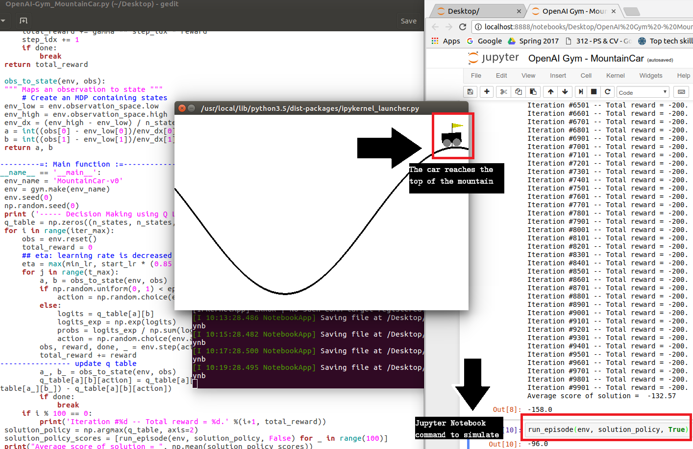
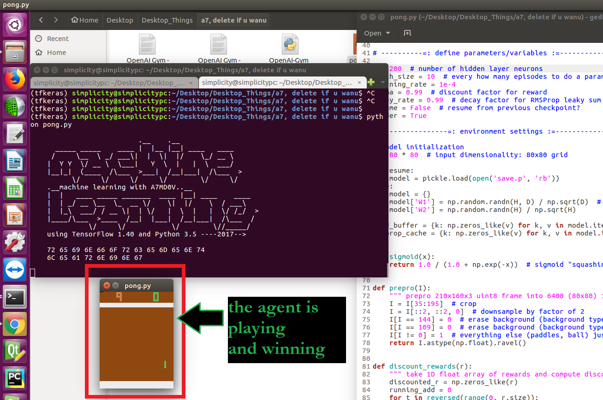

# Reinforcement Learning
RL is becoming my favoutire algorithm to train intelligent agents. I am developing a general AI agent that will learn from me and will be able to play any game.

> This repo contains code for agents that I have trained on OpenAI's Gym or Universe and other virtual environments.

## Running

OS X & Linux & Windows::

```sh
python *filename*.py
```
_All files have been developed wholesomely, meaning that you have to run only one file for one project._
## Usage example

Can be run directly or in a Jupyter Notebook. 

Dependencies: Open-AI Gym 
```sh
pip install gym
```
## Results:

### 1. Cart-Mountain



### 2. Pong



### 2. Pendulum


