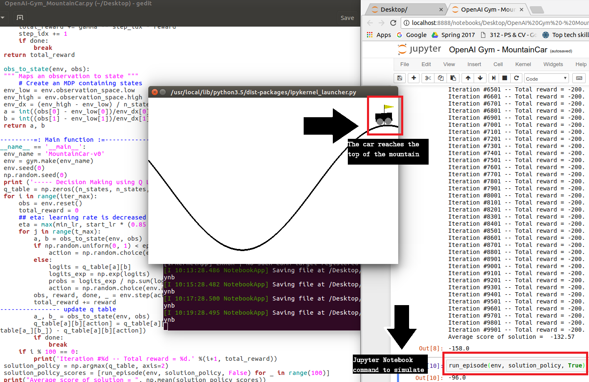

# Reinforcement Learning
> This repo contains code for agents that I have trained on OpenAI's Gym or Universe and other virtual environments.

## Running

OS X & Linux:

```sh
python *filename*.py
```

Windows:

```sh
python *filename*.py
```
_All files have been developed wholesomely, means you have to run only one file for one project._
## Usage example

Can be run directly or in a Jupyter Notebook. 

Dependencies: Open-AI Gym 
```sh
pip install gym
```
## Results:

### 1. Cart-Mountain


